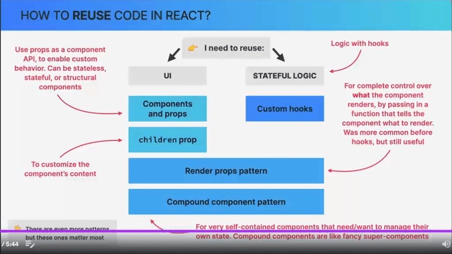

## Design Patterns



## Motivation for patterns

Example below:

```tsx
import React, { useState } from "react";
import { IProduct, ICompany } from "../../types";
import "./List.css";

interface IProductItemProps {
  product: IProduct;
}

const ProductItem = ({ product }: IProductItemProps) => (
  <li className="product">
    <p className="product-name">{product.productName}</p>
    <p className="product-price">${product.price}</p>
    <p className="product-description">{product.description}</p>
  </li>
);

interface IProps {
  title: string;
  items: IProduct[];
}

const List = ({ title, items }: IProps): JSX.Element => {
  const [isOpen, setIsOpen] = useState(true);
  const [isCollapsed, setIsCollapsed] = useState(false);

  const displayItems = isCollapsed ? items.slice(0, 3) : items;

  const toggleOpen = () => {
    setIsOpen((isOpen) => !isOpen);
    setIsCollapsed(false);
  };

  return (
    <div className="list-container">
      <div className="heading">
        <h2 className="text-1xl font-bold">{title}</h2>
        <button onClick={toggleOpen}>
          {isOpen ? <span>&or;</span> : <span>&and;</span>}
        </button>
      </div>
      {/* what do we want is: be able to reuse the all logic and Ccntrols/wrapper JSX
        exept the items list below - we want to have a flexibility
        to pass different lists: products, companies, users etc.
     */}
      {isOpen && (
        <ul className="list">
          {displayItems.map((product) => (
            <ProductItem key={product.productName} product={product} />
          ))}
        </ul>
      )}

      <button onClick={() => setIsCollapsed((isCollapsed) => !isCollapsed)}>
        {isCollapsed ? `Show all ${items.length}` : "Show less"}
      </button>
    </div>
  );
};
```

What do we want - is to keep this component logic and controls/layout JSX as it is, BUT
we want to have a flexibility to pass items list of any other types that we may need:
eg. products, companies, users etc.
